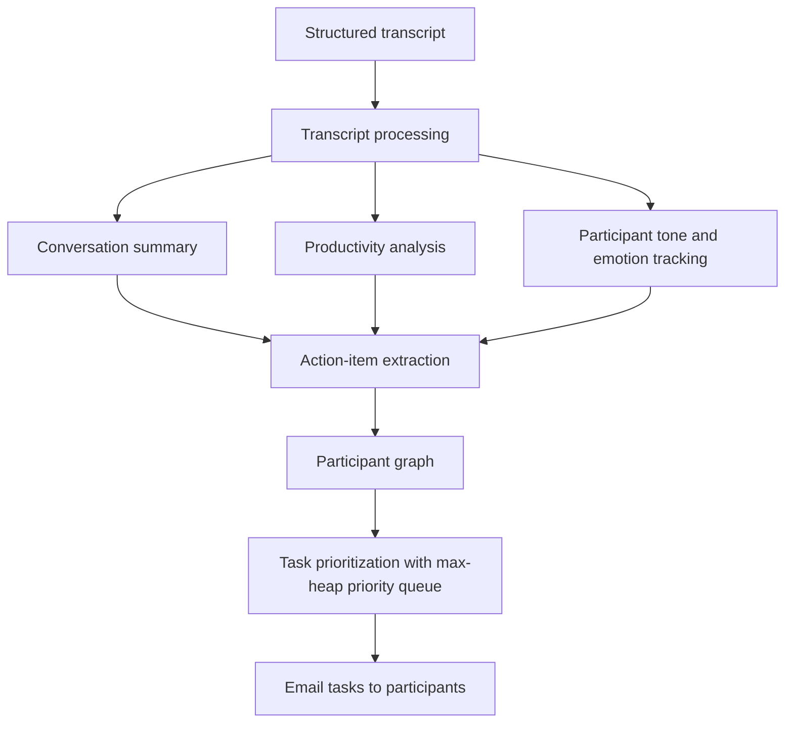

# Codex AI

## Overview

Codex AI processes structured conversation transcripts and turns them into
useful follow-up actions. The first prototype focuses on transcripts and later will be focused remaining structured
documents such as PDF, Word, and Excel files.

## Roadmap

1. Accept a structured transcript as input.
2. Generate a conversation summary.
3. Analyze call productivity and participant tone.
4. Extract action items from the conversation.
5. Model participants as nodes in a graph.
6. Prioritize tasks with a max-heap.
7. Email each participant their prioritized tasks.

## Flow Diagram



## Layout

| Path | Purpose |
| --- | --- |
| `app/main.py` | Transcript reader and word-chunk parser |
| `transcript.txt` | Sample transcript, read from the project root |
| `requrirement.txt` | Prototype requirements |

## Running It

```bash
python3 app/main.py
```

`app/main.py` builds a `Transcript` at import time and calls
`readAndFormatTheContents()`, so importing the module is enough to parse
`transcript.txt`:

```python
import sys
sys.path.insert(0, "app")
import main

main.transcript.contents  # parsed word chunks
```

## Output Structure

`readAndFormatTheContents()` walks the project folder with `rglob('*.txt')`,
keeps only the top-level `transcript.txt` (`getTranscriptPath()`), and returns
the populated `Transcript` object. The parsed result lives in `contents`.

### `Transcript.contents` — `list[str]`

The transcript flattened into space-delimited word chunks. Only ASCII letters
(`A-Z`, `a-z`) are kept, so digits and punctuation are dropped (`Q3` becomes
`Q`, `80%` is dropped entirely), and speaker labels appear inline as their own
entries.

```python
[
    "A", "Morning", "everyone", "We", "need", "to", "finalize",
    "the", "Q", "report", "before", "Friday",
    "B", "Agreed", "My", ...
]
```

For the sample `transcript.txt` this yields 87 chunks.

### `Transcript.participants` — `set`

Declared in `__init__` and used as the seen-speaker check inside the read loop,
but nothing is ever added to it, so it stays empty after parsing.

### Speaker detection — `getMembers()`

Called for every character. When the character is a newline (or the index is
`0`), it reads forward to the next `:` and returns the text before it as the
speaker label; otherwise it returns `""`. So `getMembers('\n', 5, 'A: hi\nB: yo')`
returns `"B"`.

### `LinkedList` / `Node`

A singly linked list built locally inside the read loop to collect speaker
labels. `Node` holds `value` and `next`; `LinkedList` starts from a sentinel
`Node(None)` and `addNode()` appends to it. The list is a local variable, not
stored on `Transcript`, so it is discarded when parsing finishes.

### Object shapes

| Class | Attribute | Type | Description |
| --- | --- | --- | --- |
| `Node` | `value` | `str \| None` | Payload, e.g. a speaker label |
| `Node` | `next` | `Node \| None` | Next node in the list |
| `LinkedList` | `nodes` | `Node` | Sentinel head node |
| `Transcript` | `contents` | `list[str]` | Cleaned word chunks |
| `Transcript` | `participants` | `set` | Seen-speaker set, currently unused |

## Known Gaps

- `Transcript.participants` is never populated, so the speaker-seen check in
  the read loop always passes and `addNode()` is also called with `""` for
  ordinary characters.
- `LinkedList.addNode()` does not link past the first node: its `while`
  condition (`currentNode.next is None`) stops immediately, and the final
  `currentNode = newNode` rebinds the local name instead of assigning `.next`.
  It also ignores the `id`/`value` constructor arguments.
- A word chunk is only flushed on a literal space, so a word ending at a
  newline merges with the next one (`"A: one\nB: two"` parses as
  `["A", "oneB"]`, with `two` left unflushed). The sample transcript avoids
  this because its blank lines contain a space.
- `isValidChar()` calls `ord()` on every character, so only ASCII letters
  survive — no digits, accented letters, or punctuation.

## Prototype Status

Step 1 of the roadmap is in place: the transcript is located and flattened into
word chunks. Summarization, productivity and tone analysis, action-item
extraction, the participant graph, max-heap prioritization, and email delivery
are not implemented yet.
