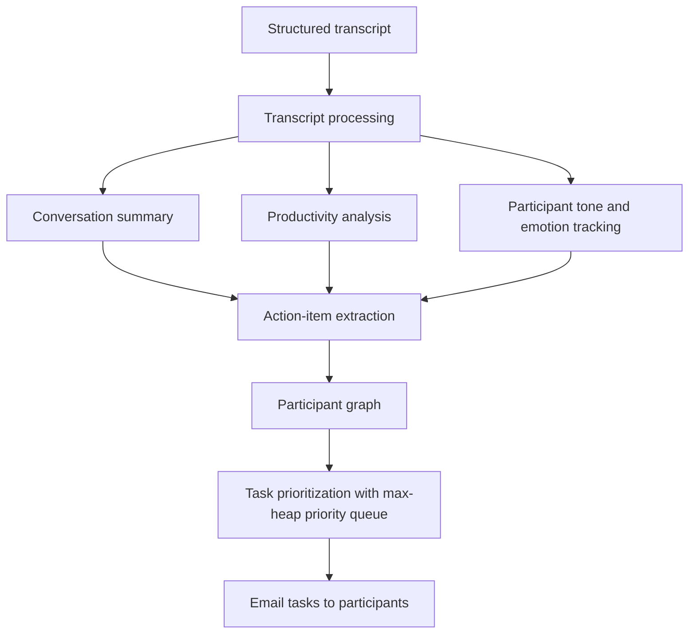

# Codex AI

## Overview

Codex AI processes structured conversation transcripts and turns them into
useful follow-up actions. The first prototype focuses on transcripts and later will be focused remaining structured
documents such as PDF, Word, and Excel files.

## Roadmap

1. Accept a structured transcript as input.
2. Generate a conversation summary.
3. Analyze call productivity and participant tone.
4. Extract action items from the conversation.
5. Model participants as nodes in a graph.
6. Prioritize tasks with a max-heap.
7. Email each participant their prioritized tasks.

## Flow Diagram



## Output Structure

`readAndFormatTheContents()` walks the project folder, picks up the top-level
`transcript.txt`, and returns the populated `Transcript` object. The parsed
result lives in two attributes:

### `Transcript.contents` — `list[str]`

The transcript flattened into whitespace-delimited word chunks. Only ASCII
letters (`A-Z`, `a-z`) are kept, so digits and punctuation are dropped
(`Q3` becomes `Q`, `80%` is dropped entirely), and speaker labels appear
inline as their own entries.

```python
[
    "A", "Morning", "everyone", "We", "need", "to", "finalize",
    "the", "Q", "report", "before", "Friday",
    "B", "Agreed", "My", ...
]
```

### `Transcript.participants` — `dict[str, Graph]`

One entry per speaker, keyed by the label that precedes the `:` at the start
of a line. Each value is a `Graph` whose `nodes` and `startNode` are `Node`
instances seeded with that participant's id.

```python
{
    "A": Graph(nodes=Node(id="A", value=""), startNode=Node(id="A", value="")),
    "B": Graph(nodes=Node(id="B", value=""), startNode=Node(id="B", value="")),
    "C": Graph(nodes=Node(id="C", value=""), startNode=Node(id="C", value="")),
    "D": Graph(nodes=Node(id="D", value=""), startNode=Node(id="D", value="")),
}
```

### Object shapes

| Class | Attribute | Type | Description |
| --- | --- | --- | --- |
| `Node` | `id` | `str` | Participant label, e.g. `"A"` |
| `Node` | `value` | `str` | Payload slot, unused so far |
| `Graph` | `nodes` | `Node` | Node created for the participant |
| `Graph` | `startNode` | `Node` | Entry point into the participant graph |
| `Transcript` | `contents` | `list[str]` | Cleaned word chunks |
| `Transcript` | `participants` | `dict[str, Graph]` | Speaker label to graph |

## Prototype Status

The prototype is complete.
