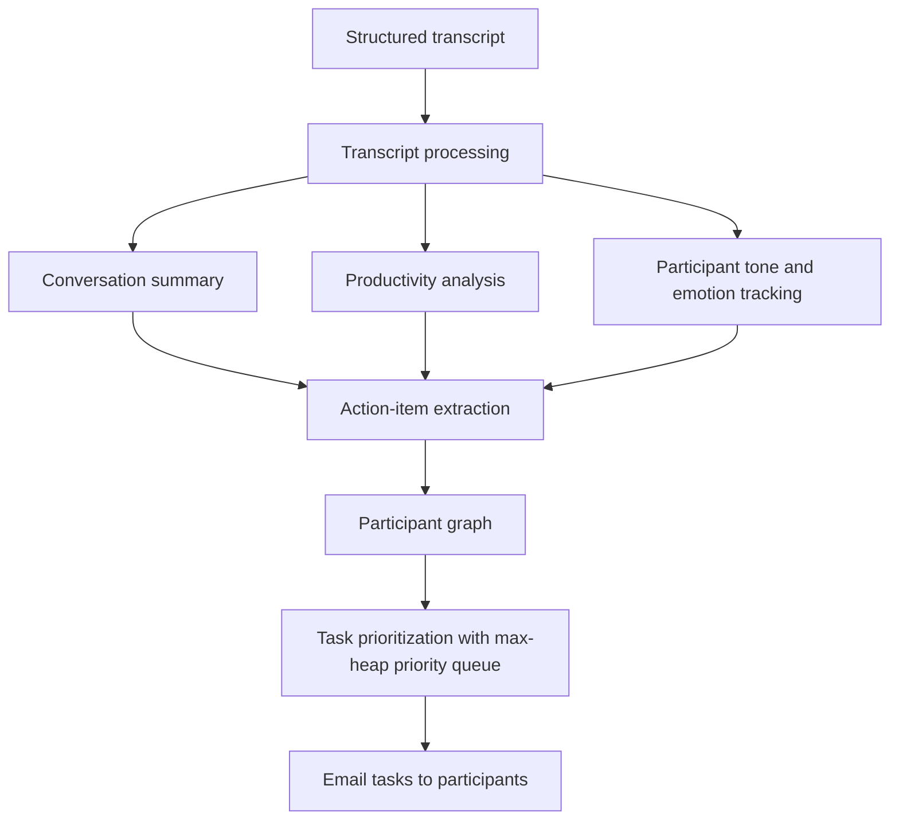
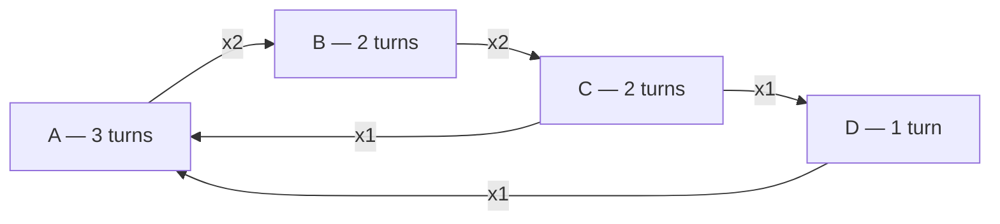

# Codex AI

## Overview

Codex AI processes structured conversation transcripts and turns them into
useful follow-up actions. The first prototype focuses on transcripts and later will be focused remaining structured
documents such as PDF, Word, and Excel files.

## Roadmap

1. Accept a structured transcript as input.
2. Generate a conversation summary.
3. Analyze call productivity and participant tone.
4. Extract action items from the conversation.
5. Model participants as nodes in a graph.
6. Prioritize tasks with a max-heap.
7. Email each participant their prioritized tasks.

## Flow Diagram



## Layout

| Path | Purpose |
| --- | --- |
| `app/main.py` | Transcript reader, word-chunk parser, and participant graph builder |
| `transcript.txt` | Sample transcript, read from the project root |
| `requrirement.txt` | Prototype requirements |

## Running It

```bash
python3 app/main.py
```

`app/main.py` builds a `Transcript` at import time and calls
`readAndFormatTheContents()`, so importing the module is enough to parse
`transcript.txt` (it also prints the graph and the word chunks on import):

```python
import sys
sys.path.insert(0, "app")
import main

main.transcript.contents      # parsed word chunks
main.transcript.graph.nodes   # participants keyed by speaker label
main.transcript.graph.edges   # who-follows-whom counts
```

For the sample transcript the script prints:

```
Graph with 4 nodes
  A: 3 turns at offsets [2, 261, 429]
  B: 2 turns at offsets [74, 302]
  C: 2 turns at offsets [133, 348]
  D: 1 turns at offsets [187]
edges:
  A -> B (x2)
  B -> C (x2)
  C -> D (x1)
  C -> A (x1)
  D -> A (x1)
```

## Output Structure

`readAndFormatTheContents()` walks the project folder with `rglob('*.txt')`,
keeps only the top-level `transcript.txt` (`getTranscriptPath()`), and scans the
file character by character. Each character feeds two things: the word-chunk
buffer (`contents`) and the speaker detector that builds the participant graph.

### `Transcript.contents` — `list[str]`

The transcript flattened into space-delimited word chunks. Only ASCII letters
(`A-Z`, `a-z`) are kept, so digits and punctuation are dropped (`Q3` becomes
`Q`, `80%` is dropped entirely, `I'll` becomes `Ill`), and speaker labels appear
inline as their own entries.

```python
[
    "A", "Morning", "everyone", "We", "need", "to", "finalize",
    "the", "Q", "report", "before", "Friday",
    "B", "Agreed", "My", ...
]
```

For the sample `transcript.txt` this yields 87 chunks.

### `Transcript.graph` — `Graph`

The participant graph, built while the transcript is scanned. Every speaker
label becomes a node; every hand-off from one speaker to the next becomes a
weighted directed edge.

- `graph.nodes` — `dict[str, Node]`, one entry per speaker label (`"A"`, `"B"`, …).
- `graph.edges` — `dict[str, dict[str, int]]`, adjacency map where
  `edges["A"]["B"] == 2` means B spoke immediately after A twice.
- `graph.prevNode` — the last speaker seen, used to attach the next edge.

`addNodeAndEdge(adjacentNode, turn, line)` creates the node and its (initially
empty) edge map on first sight, records the turn on the node, then increments
the edge from `prevNode` to it. The first speaker adds no edge because
`prevNode` is still `None`.

#### Graph shape for the sample transcript

Nodes are speakers, arrows point from a speaker to whoever spoke next, and the
label on the arrow is how many times that hand-off happened.



The same graph in plain text:

```
   ┌───────────────── x1 ─────────────────────┐
   │                                          │
   │   ┌─────┐ ────────── x2 ──────> ┌─────┐  │
   └──>│  A  │                       │  B  │  │
       │  3  │                       │  2  │  │
       └─────┘                       └─────┘  │
          ▲                             │     │
          │ x1                       x2 │     │
          │                             ▼     │
       ┌─────┐ <───────── x1 ─────── ┌─────┐  │
       │  D  │                       │  C  │──┘
       │  1  │                       │  2  │
       └─────┘                       └─────┘

   box = speaker label / turn count      arrow = "spoke immediately after"
   xN  = edge weight (times that hand-off happened)
```

The edges are a walk over the turn order — 8 turns, so 7 hand-offs:

```
  A ──> B ──> C ──> D ──> A ──> B ──> C ──> A
  2    74   133   187   261   302   348   429   ← char offsets in Node.turns
```

The first four hand-offs trace the outer cycle `A→B→C→D→A`; turns 5-7 repeat
`A→B→C`, which is why those two edges carry weight 2; the last `C→A` is the
chord across the middle. `A` is the hub — every path returns to it, matching a
transcript where A opens, redirects, and closes the call.

In memory that is:

```python
graph.nodes = {                                   graph.edges = {
    "A": Node("A", turns=[2, 261, 429],               "A": {"B": 2},
                   lines=[3, 262, 430]),              "B": {"C": 2},
    "B": Node("B", turns=[74, 302], ...),             "C": {"D": 1, "A": 1},
    "C": Node("C", turns=[133, 348], ...),            "D": {"A": 1},
    "D": Node("D", turns=[187], ...),             }
}                                                 # prevNode == "A"
```

Edges are directed, so `A -> B` (2) and `B -> A` (absent) are independent — `A`
never follows `B` in this transcript. A speaker taking two turns in a row would
produce a self-loop (`edges["X"]["X"]`); nobody does in this sample.

### `Node` — a participant

| Attribute | Type | Description |
| --- | --- | --- |
| `id` | `str` | Speaker label as it appears before the `:` |
| `turns` | `list[int]` | Character offset where each of this speaker's turns starts |
| `lines` | `list[int]` | Character offset of the `:` that ends each speaker label |

Both lists are parallel: `turns[i]` and `lines[i]` describe the same turn. Note
that `lines` holds a character offset, not a line number, despite the name.

### Speaker detection — `getMembers()`

Called for every character, and returns `[member, turn, line]`. When the
character is a newline (or the index is `0`), it reads forward to the next `:`
and returns the text before it as the speaker label, along with the offsets it
starts at and the offset of the `:`; it bails out at a second newline. Every
other character returns `["", 0, 0]`, and the empty label is skipped by the
caller. So `getMembers('\n', 5, 'A: hi\nB: yo')` returns `["B", 6, 7]`.

### Object shapes

| Class | Attribute | Type | Description |
| --- | --- | --- | --- |
| `Node` | `id` | `str` | Speaker label |
| `Node` | `turns` | `list[int]` | Turn start offsets |
| `Node` | `lines` | `list[int]` | Offsets of the label's `:` |
| `Graph` | `nodes` | `dict[str, Node]` | Participants by label |
| `Graph` | `edges` | `dict[str, dict[str, int]]` | Weighted hand-off counts |
| `Graph` | `prevNode` | `str \| None` | Previous speaker |
| `Transcript` | `contents` | `list[str]` | Cleaned word chunks |
| `Transcript` | `graph` | `Graph` | Participant graph |

## Known Gaps

- Speaker labels are also emitted into `contents`, so `"A"`, `"B"`, … appear as
  word chunks mixed in with the actual words.
- A word chunk is only flushed on a literal space, so a word ending at a
  newline merges with the next one (`"A: one\nB: two"` parses as
  `["A", "oneB"]`, with `two` left unflushed). The sample transcript avoids
  this because its blank lines contain a space, including the trailing one that
  flushes the final word.
- `isValidChar()` calls `ord()` on every character, so only ASCII letters
  survive — no digits, accented letters, or punctuation.
- `getMembers()` treats anything before the first `:` on a line as a speaker
  label, so a line such as `Note: see below` would be recorded as a participant
  named `Note`.
- The graph only records turn offsets. The utterance text is not attached to
  its speaker yet, and a speaker taking two turns in a row would produce a
  self-loop edge.
- `main.py` parses and prints at import time, so there is no reusable entry
  point or test hook.

## Prototype Status

Step 1 of the roadmap is in place — the transcript is located, flattened into
word chunks, and the participants are extracted — and step 5 is partly there:
the participant graph exists with turn counts and speaker hand-off edges, but
no action items are attached to it yet. Summarization, productivity and tone
analysis, action-item extraction, max-heap prioritization, and email delivery
are not implemented yet.
